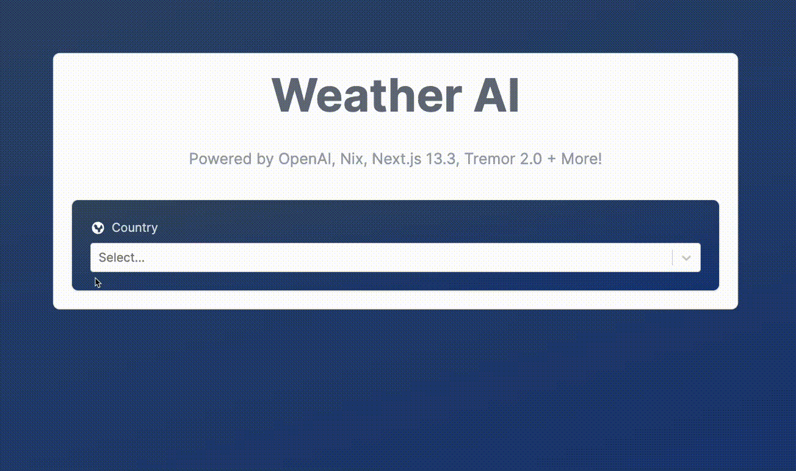

# StepZen Weather AI App

A Stepzen Weather AI App using the chatGPT API.
*Development in-process.*

Check out a live [demo](https://ai-weather-app-kappa.vercel.app/).

### Development:
- [Next.js](https://nextjs.org/) as package manager
- [TypeScript](https://www.typescriptlang.org/) - scalable, reliable web dev language
- [React](https://react.dev/) - web library
- [StepZen](https://stepzen.com/) is a GraphQL server with a unique architecture.
- [Free Weather API](https://open-meteo.com/)
- [Weather API Icons](https://www.weatherbit.io/)
- [Tremor](https://www.tremor.so/) for stylized components
- [Tailwind CSS](https://tailwindcss.com/)


## Getting Started

### 🔑
Create '.env' at the root of your project and include the following environment variables to your project:

- API_URL=
- NEXT_PUBLIC_STEPZEN_API_KEY=
- OPENAI_API_KEY=
- NODE_ENV=
- VERCEL_URL=

### Frontend
First, install packages and run the development server:

```bash
yarn
yarn run dev
```

Open [http://localhost:3000](http://localhost:3000) with your browser to see the result.
### Backend

To run the backend server, run the following command in a seperate terminal.

```bash
start-stepzen
```

Open the `localhost:5001` with your browser to see the result.

## Walkthrough
The landing page will have an seletion for `Country`, (optionally `State`), and `City`.


<p style="text-align: center;">Landing Page</p>

Once the city of choice has been selected, the request is posted and the client will be directed to a page with the corresponding city weather information (e.g. example shown below). The information panel allows the client to change cities. The selected city displays the local time, sunruse, sunset, and collection of other metrics.


<p style="text-align: center;">Desktop View & Responsive</p>

This application is mobile responsive. The example is shown below.


